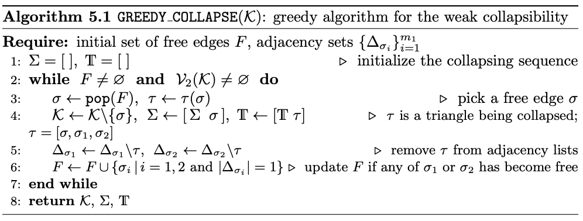

[](https://arxiv.org/abs/2401.15492)


# `HeCS`: Heavy Collapsible preconditioner for linear systems with weighted Hodge Laplacians on simplicial complexes

This repository provides the code for  Heavy Collapsible preconditioner for linear systems with weighted Hodge Laplacians on simplicial complexes from **"Cholesky-like Preconditioner for Hodge Laplacians via Heavy Collapsible Subcomplex"** by Anton Savostianov, Nicola Guglielmi and Francesco Tudisco.


## Background

We advise to consult the companion paper:

> [**"Cholesky-like Preconditioner for Hodge Laplacians via Heavy Collapsible Subcomplex"**](https://arxiv.org/abs/2401.15492)
> > by _Anton Savostianov, Nicola Guglielmi and Francesco Tudisco_


## Principle Functions

+ `generateDelaunay( N = 4 )` – function samples `N` random points on the unit square and return lists of points (including corners), edges and triangles in Delaunay triangulation; provided in `generateDelaunay.jl` module;

+ `sparseDelaunay( ; N = 10, ν = 0.4 )` – calls `generateDelaunay` function and enriches it randomly to the sparsity pattern `ν` by functions `getIndx2Kill`, `killEdge`, `getNewEdge2` and `addEdge`; provided in `generateDelaunay.jl` module; 

+ `greedyCollapse` and `greedyCollapseShort` (requires precomputed edge->triangle structures) perform complete and online greedy collapse algorithm on the simplicial complex (see algorithm below); provided in `collapse.jl`



+ `cgls( A, b; tol = 1e-3, maxit = 500000 )` – naive `julia` implementation of CGLS method; provided in `cgls.jl`;

+ function `B2fromTrig`, `getEdge2Trig`, `getTrig2Edge` generate edge-triangle related structures from lists of edges and triangles with the corresponding boundary operator `B2`; provided in `simplicialComplex.jl`.
  
## Minimal Working Example
### 1. Simplex generation
```julia 
include("utils.jl")
include("cgls.jl")
include("generateDelaunay.jl")
include("simplicialComplex.jl")
include("collapse.jl")

N = 21 # number of sampled points

# generate Delaunay with `add` number of new edges
points, edges, trigs = generateDelauney( N )
edges2, trigs2 = deepcopy(edges), deepcopy(trigs)
n = N + 4
ν_Δ = size(edges, 1) / binomial( n, 2 )

add = 6 # how many edges do we need to add            
allEdges = getAllEdges(n)
for i in axes(edges2, 1)
      indx = findall(all(allEdges .== edges2[i, :]', dims=2))[1][1]
      allEdges = allEdges[ 1:size(allEdges, 1) .!= indx, : ]
end
for i in 1 : add      
      ind, allEdges = getNewEdge2(n, edges2, allEdges);
      edges2, trigs2 = addEdge(ind, n, edges2, trigs2)
end

edg2Trig = getEdges2Trig( edges2, trigs2 )
trig2Edge = getTrig2Edg( edges2, trigs2, edg2Trig )
```
### 2. Weight profiles and matrices
```julia
w = zeros( size(trigs2, 1), 1 )
m = size( edges2, 1 )
Δ = size( trigs2, 1 )
w_e = abs.( randn( size(edges2, 1) ) )
for i in 1 : Δ
      w[i] = minimum( w_e[ collect( trig2Edge[i] ) ]  )
end

W = diagm(vec(sqrt.(w)))
B2 = B2fromTrig( edges2, trigs2 )
Lu =  B2 * W * W * B2'
```
### 3. `HeCS` run 
```julia
perm = sortperm( w, dims =1, rev = true ) # remember the order of weights

sub = [ ] 
ind = 1

subEdg2Trigs = [ Set([ ]) for i in 1 : m ]
subTrig2Edg = [ ]

while ind <= Δ
      global subEdg2Trigs, subTrig2Edg, trig2Edg, sub, ind, edges2

      # form a new subcomplex
      tmpSubEdg2Trigs = deepcopy( subEdg2Trigs )
      tmpSubTrig2Edg = deepcopy( subTrig2Edg )
      tmpSub = deepcopy( sub )

      tmpSub = [ tmpSub; perm[ind] ]
      tmpSubTrig2Edg = [ tmpSubTrig2Edg; trig2Edge[ perm[ind] ] ]
      for e in trig2Edge[ perm[ind] ]
            tmpSubEdg2Trigs[e] = union( tmpSubEdg2Trigs[e], perm[ind] )
      end

      # check if it is collapsible
      fl, Σ, Τ, edge2Trig, trig2Edg, Ls, Free = greedyCollapseShort( tmpSubEdg2Trigs, tmpSubTrig2Edg, tmpSub, edges2 )
      
      # if collapsible, extend subcomplex by the new triangle
      if fl
            sub = [ sub; perm[ind] ]
            subTrig2Edg = [ subTrig2Edg; trig2Edge[ perm[ind] ] ]
            for e in trig2Edge[ perm[ind] ]
                  subEdg2Trigs[e] = union( subEdg2Trigs[e], perm[ind] )
            end
      end
      ind = ind + 1
end

# form subsampling matrices
filter = sub
Π = indicator( sort(filter), Δ )
trigs3 = trigs2[ sort(filter), :]
fl, Σ, Τ, edge2Trig2, trig2Edg2, Ls, Free = greedyCollapse( edges2, trigs3 )

# form collapsing sequences
Σ_full = [ Σ; sort(collect(setdiff( Set(1:m), Set(Σ)))) ]
Τ_full = [ filter[Τ]; sort(collect(setdiff( Set(1:Δ), Set(filter[Τ]))))  ]
```
### 4. Performance evaluation 
```julia
P1 = Perm( Σ_full )
P2 = Perm( Τ_full )

# Cholesky multiplier
C = P1 * B2 * W * Π * P2

# preconditioned operator
Lu2 = pinv(C) * P1 * Lu * P1' * pinv(C')
Lu2 = Lu2[1:size(sub,1), 1:size(sub,1)]

# print condition numbers
print( condPlus(Lu), condPlus(Lu2) ) 

# print number of CGLS iterations
_, it_original = cgls(Lu, Lu*ones( size(Lu, 1) ))
_, it_precon = cgls(Lu2, Lu2*ones( size(Lu2, 1) ))
print( it_original, it_precon )
```

More comprehensive testing loop is provided in `loop.jl`.

## Base Julia dependencies

```julia
using GR: delaunay  # Delaunay triangulation
using StatsBase, Distributions # sampling
using LinearAlgebra, Arpack, Random, SparseArrays # LA
using ArnoldiMethod, Krylov, LinearMaps # eig in LA
using BenchmarkTools, Printf, TimerOutputs # timings and staff

# and plotting
using Plots, ColorSchemes, Plots.PlotMeasures,  LaTeXStrings
pgfplotsx()
theme(:mute)
Plots.scalefontsizes(1.75)
cols=ColorSchemes.Spectral_11;
```